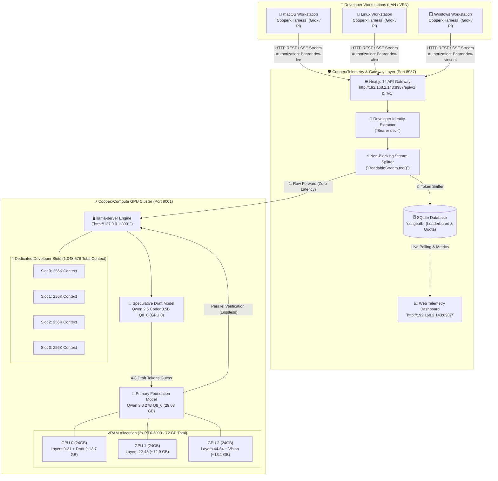

# 🏛️ CooperAgent — System Architecture & Engineering Blueprint (`ARCHITECTURE.md`)

> **Document Version:** 2.0.0 (Enterprise Gold Release — CooperAgent)  
> **Target Repository:** `https://github.com/LyKhan77/grok-x-team-byLee.git`  
> **Classification:** Internal Engineering Single Source of Truth (SSOT)  
> **Last Updated:** 20 Agustus 2026  

---

## 1. Executive Overview & System Topology

**CooperAgent** adalah platform *Enterprise Autonomous Coding Agent* generasi masa depan yang mengintegrasikan ekosistem multi-agent harness (**`CooperxHarness`: Grok Build TUI & Pi Agent CLI**) dengan infrastruktur komputasi lokal GPU berkapasitas tinggi (**`CooperxCompute`: `llama.cpp` + Qwen 3.8 / 2.5 27B Q8_0 + Qwen 0.5B Speculative Accelerator pada 3x RTX 3090**) dan sistem persistensi memori mandiri (**`CooperxMemory`**).

Platform ini dirancang dengan prinsip **100% Kedaulatan Data (*Zero Data Exfiltration*)**: tidak ada sebaris kode pun, prompt, gambar diagram arsitektur, maupun proses penalaran (*Chain-of-Thought*) yang dikirim ke cloud publik pihak ketiga.



---

## 2. Modul Cooperx Ecosystem

Setiap fitur dan subsistem dalam platform CooperAgent memiliki kode seri standar:

| Modul | Nama Sistem | Deskripsi Teknis |
| :--- | :--- | :--- |
| **`CooperxCompute`** | Inference & Hardware Engine | 4 Slots x 256K Context (Total 1M Tokens), Speculative Acceleration, KV-Cache `q4_0` pada 3x RTX 3090. |
| **`CooperxMemory`** | Autonomous State & Handover | Checkpoint `.agents/memory/session_state.md`, 90% Context Warning Card, dan Instant 0-Token Rehydration. |
| **`CooperxHarness`** | Multi-Agent Ecosystem | Dukungan native untuk **Grok Build (Rust TUI)** dan **Pi Agent (Inline CLI)** di Linux, macOS, dan Windows. |
| **`CooperxTelemetry`** | Telemetry Gateway & Dashboard | Next.js 14 API Gateway (Port `8987`), Developer Identity Tracker, dan Dark Mode TUI Dashboard. |
| **`CooperxStandard`** | Adaptive Standardization | Wizard 5 pertanyaan interaktif (`/standardization`) untuk menyusun aturan repository secara adaptif. |

---

## 3. Layer 1: Hardware & Compute Infrastructure (`CooperxCompute`)

### 3.1 Spesifikasi Hardware Host
* **GPU Cluster:** 3x NVIDIA GeForce RTX 3090 (24 GB GDDR6X per GPU, Total 72 GB VRAM).
* **CPU Host:** Intel(R) Core(TM) Ultra 7 265 (20 Physical Cores, Single NUMA Node 0).
* **RAM Sistem:** 64 GB DDR5.
* **PCIe Bus Topology:** P2P PCIe Gen4 direct bus communication.

### 3.2 Alokasi 4 Slots x 256K Dedicated Context (Total 1.048.576 Tokens)
* **Model Utama:** **`Qwen 3.8 / 2.5 27B Q8_0`** (27.32B parameters, file GGUF ~29.03 GB).
* **Speculative Draft Model:** **`Qwen2.5-Coder-0.5B-Q8_0.gguf`** (~400 MB pada GPU 0).
* **Kuantisasi KV-Cache `q4_0`:** Total 1M tokens memakan **~37.7 GB Total** (**~12.58 GB per GPU**).
* **Total VRAM Terpakai:** **~22.26 GB / 24.57 GB per GPU** (Menyisakan buffer aman **~2.31 GB VRAM bebas** per kartu).

---

## 4. Layer 2: Persistence Memory Harness (`CooperxMemory`)

Terinspirasi dari arsitektur memori **Claude Code** (`CLAUDE.md` memory ledger) dan **Hermes Agent** (Dual-tier episodic/semantic eviction):

```
┌─────────────────────────────────────────────────────────────────────────────┐
│                 CooperxMemory HARNESS (HANDOVER & RECOVERY FLOW)            │
├─────────────────────────────────────────────────────────────────────────────┤
│                                                                             │
│  1. CONTINUOUS CHECKPOINTING (.agents/memory/session_state.md)              │
│     Setiap kali agent selesai membuat/mengedit file, agent meng-update:     │
│     - Goal Utama Proyek                                                     │
│     - File-file yang telah dibuat & status test                             │
│     - Checklist plan.md yang sedang berjalan                                │
│                               │                                             │
│                               ▼                                             │
│  2. EARLY WARNING & CONTEXT MONITOR (Threshold 90%)                         │
│     Ketika sesi mencapai ~230K tokens (90% dari 256K), agent menampilkan:  │
│     ┌─────────────────────────────────────────────────────────────────┐     │
│     │ ⚠️ CooperxMemory NOTICE: Context 90% reached                    │     │
│     │ State kerja tersimpan aman di `.agents/memory/session_state.md`│     │
│     │                                                                 │     │
│     │ 💡 UNTUK MELANJUTKAN DENGAN CONTEXT BERSIH (0 TOKEN):           │     │
│     │ 1. Ketik `/clear` di terminal agent                             │     │
│     │ 2. Ketik `Lanjutkan session_state.md`                           │     │
│     └─────────────────────────────────────────────────────────────────┘     │
│                               │                                             │
│                               ▼                                             │
│  3. INSTANT REHYDRATION (Zero Data Loss & Zero Freeze)                      │
│     Pada sesi baru (0 token), agent hanya membaca session_state.md          │
│     (~1.500 token) dan langsung melanjutkan tugas detik itu juga!           │
└─────────────────────────────────────────────────────────────────────────────┘
```

---

## 5. Layer 3: Multi-Agent Client Ecosystem (`CooperxHarness`)

### 5.1 Grok Build (Rust Fullscreen TUI)
* Pilihan utama untuk pengalaman visual komprehensif: Split-screen visual diff viewer, file tree viewer, multi-session tab manager (`Ctrl+T`), dan model picker (`Ctrl+M`).

### 5.2 Pi Agent (Lightweight Inline CLI)
* Alternatif ringan berbasis perintah terminal cepat, ideal untuk lingkungan server headless, koneksi SSH cepat, atau developer yang menyukai antarmuka minimalis.

---

## 6. Layer 4: 2-Tier Inference & Telemetry Gateway (`CooperxTelemetry`)

* **Public Port 8987 (`0.0.0.0:8987`):**
  - Web Dashboard UI: `http://192.168.2.143:8987/`
  - OpenAI-Compatible Endpoint: `http://192.168.2.143:8987/v1` & `/api/v1`
  - Health Check: `http://192.168.2.143:8987/api/health` & `/health`
  - Developer Identity: Header `Authorization: Bearer dev-<nickname>`
* **Private Port 8001 (`127.0.0.1:8001`):**
  - Backend inferensi GPU `llama-server` terisolasi dari akses jaringan luar langsung.

---

## 7. Ringkasan File Proyek

| File / Direktori | Deskripsi Arsitektur CooperAgent |
| :--- | :--- |
| [`ARCHITECTURE.md`](ARCHITECTURE.md) | Cetak biru arsitektur resmi CooperAgent & modul Cooperx |
| [`AGENTS.md`](AGENTS.md) | Single Source of Truth pedoman developer & AI agent |
| [`README.md`](README.md) | Panduan onboarding developer multi-OS |
| [`server-optimize.sh`](server-optimize.sh) | Runner `CooperxCompute` 4 Slots x 256K Context (3x RTX 3090) |
| [`setup.sh`](setup.sh) | Onboarding 1-Click Linux & macOS (`CooperxHarness`) |
| [`setup.ps1`](setup.ps1) | Onboarding 1-Click Windows PowerShell (`CooperxHarness`) |
| [`config.default.toml`](config.default.toml) | Konfigurasi default 256K Context Window |
| [`.agents/rules/05-cooperx-memory.md`](.agents/rules/05-cooperx-memory.md) | Standar persistensi memori `CooperxMemory` |
| [`dashboard/`](dashboard/) | Web Telemetry Dashboard & API Gateway (`CooperxTelemetry`) |
