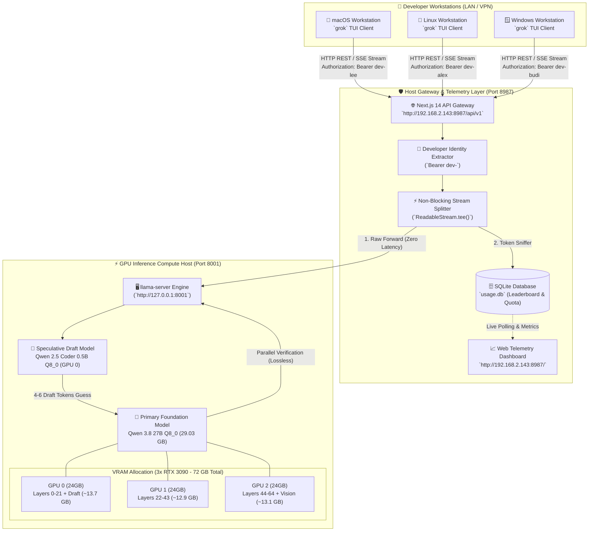
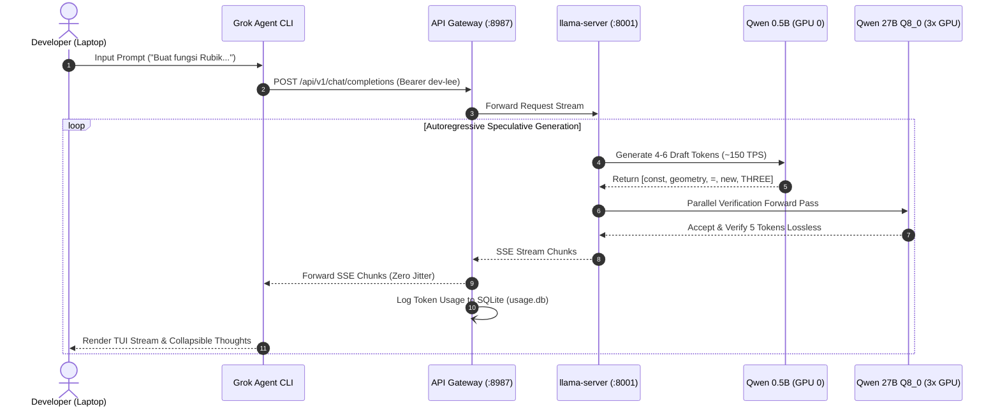
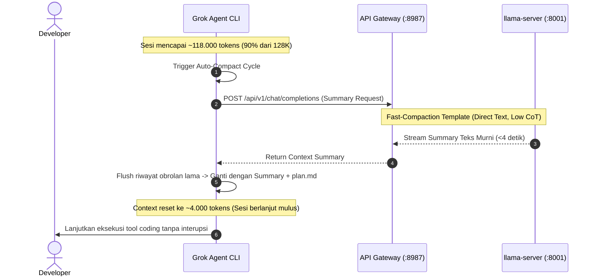

# 🏛️ GSPExGrok Agent — System Architecture & Engineering Blueprint (`ARCHITECTURE.md`)

> **Document Version:** 1.0.0 (Enterprise Gold Release)  
> **Target Repository:** `https://github.com/LyKhan77/grok-x-team-byLee.git`  
> **Classification:** Internal Engineering Single Source of Truth (SSOT)  
> **Last Updated:** 19 Agustus 2026  

---

## 1. Executive Overview & System Topology

**GSPExGrok Agent (`gspexgrok-agent`)** adalah platform *On-Premise Enterprise Coding Agent* berkemampuan tinggi yang mengintegrasikan terminal agent berbasis Rust (**Fork Grok Build**) dengan kluster inferensi lokal GPU berkecepatan tinggi (**`llama.cpp` + Qwen 3.8 / 2.5 27B Q8_0**) dan gerbang telemetri terpadu (**Next.js 14 API Gateway & Telemetry Dashboard**).

Platform ini dirancang dengan prinsip **100% Kedaulatan Data (*Zero Data Exfiltration*)**: tidak ada sebaris kode pun, prompt, gambar diagram arsitektur, maupun proses penalaran (*Chain-of-Thought*) yang dikirim ke cloud publik pihak ketiga.



---

## 2. Layer 1: Hardware & Compute Infrastructure

### 2.1 Spesifikasi Hardware Host
* **GPU Cluster:** 3x NVIDIA GeForce RTX 3090 (24 GB GDDR6X per GPU, Total 72 GB VRAM).
* **CPU Host:** Intel(R) Core(TM) Ultra 7 265 (20 Physical Cores, Single NUMA Node 0).
* **RAM Sistem:** 64 GB DDR5.
* **PCIe Bus Topology:** P2P PCIe Gen4 direct bus communication.

### 2.2 Arsitektur Model & Dual-Model Speculative Decoding
1. **Primary Foundation Model:**
   * Model: **`Qwen 3.8 / 2.5 27B Q8_0`** (27.32B parameters, file GGUF ~29.03 GB).
   * Multimodal Projector: **`mmproj-BF16.gguf`** (Vision comprehension untuk diagram & screenshot UI).
   * Context Alocation: Total **262.144 tokens** dibagi menjadi **2 Developer Slots berkapasitas 131.072 tokens (128K dedicated) per slot**.
2. **Speculative Draft Model (Acceleration Engine):**
   * Model: **`Qwen2.5-Coder-0.5B-Q8_0.gguf`** (~400 MB di VRAM GPU 0).
   * Algoritma: *Lossless Rejection Sampling* (Google DeepMind - Leviathan et al., 2023).
   * Cara Kerja: Model draft 0.5B memprediksi 4–6 token instan di latar belakang (~150 TPS), kemudian diverifikasi secara paralel oleh model 27B utama dalam 1 siklus forward pass.
   * **Jaminan Kualitas:** Akurasi **100% identik secara matematis** dengan model 27B murni, menghasilkan throughput **~27 TPS single-stream** dan memangkas latensi TTFT ke **~372 ms**.

### 2.3 Optimasi KV-Cache & Kernel CPU
* **Kuantisasi KV-Cache `q4_0`:** `--cache-type-k q4_0 --cache-type-v q4_0` memangkas 50% lalu lintas memori VRAM saat context memanjang hingga 128K tokens.
* **CPU 20-Core Spin-Lock Polling:** `--threads 16 --threads-batch 20 --poll 100` mengeliminasi jeda *thread wake-up / context switching* pada kernel Linux.
* **CUDA Batch Saturation:** `--batch-size 4096 --ubatch-size 1024` memaksimalkan Tensor Core Ampere saat memproses *prefill* file berukuran besar.

---

## 3. Layer 2: 2-Tier Inference & API Gateway Routing

Sistem menggunakan **Arsitektur 2-Tier** untuk memisahkan komputasi mentah AI dengan layer keamanan, kuota, dan monitoring:

```
┌─────────────────────────────────────────────────────────────────────────────────────────┐
│                                 2-TIER ENTERPRISE TOPOLOGY                              │
├─────────────────────────────────────────────────────────────────────────────────────────┤
│                                                                                         │
│  [TIER 1: PUBLIC GATEWAY & DASHBOARD] ──▶ Port 8987 (0.0.0.0:8987)                      │
│  - Web Dashboard UI:     http://192.168.2.143:8987/                                     │
│  - Grok Agent Gateway:   http://192.168.2.143:8987/api/v1/chat/completions              │
│  - Gateway Health Check: http://192.168.2.143:8987/api/health                           │
│  - Authorization Header: Bearer dev-<nickname>                                          │
│                                                                                         │
│                              │ Forward Stream (ReadableStream.tee())                    │
│                              ▼                                                          │
│  [TIER 2: PRIVATE GPU INFERENCE]      ──▶ Port 8001 (127.0.0.1:8001)                    │
│  - Llama-Server Engine (Terisolasi dari akses publik luar)                              │
│  - Menjalankan Qwen 27B Q8_0 + Qwen 0.5B Speculative Accelerator                        │
└─────────────────────────────────────────────────────────────────────────────────────────┘
```

### 3.1 Developer Identity Extraction Protocol
Setiap request yang dikirimkan oleh Grok Agent menyertakan header otorisasi unik:
$$\text{Authorization: Bearer dev-}\langle\text{nickname}\rangle$$

1. Gateway membaca token `dev-<nickname>`.
2. Gateway mengkombinasikan nickname dengan IP client: `lee (192.168.2.45)`.
3. Seluruh konsumsi token (prompt & completion) diagregasikan secara otomatis ke database SQLite `usage.db`.

---

## 4. Layer 3: Agent Client & Harness Runtime

### 4.1 Upstream Engine: Fork Grok Build
* Ditulis dalam bahasa pemrograman **Rust** dengan antarmuka TUI berbasis **Ratatui** dan async I/O berbasis **Tokio**.
* Dilengkapi AST search engine berbasis **Tree-sitter** untuk navigasi kode sumber berkecepatan tinggi.

### 4.2 Parameter Emas Konfigurasi Client (`~/.grok/config.toml`)
```toml
[cli]
auto_update = false

[features]
telemetry = false

[session]
auto_compact_threshold_percent = 90    # Memicu ringkasan hanya saat context mencapai ~118K tokens
load_envrc = true

[models]
default = "internal-qwen"
stream_tool_calls = true
temperature = 0.7
top_p = 0.85
min_p = 0.05
repeat_penalty = 1.1
max_completion_tokens = 65536

[model.internal-qwen]
model = "qwen35"
base_url = "http://192.168.2.143:8987/api/v1"
name = "Internal Qwen 3.8 (27B Q8 - 128K Dedicated)"
description = "Dedicated 128K Context via Port 8987 Gateway"
api_backend = "chat_completions"
context_window = 131072
max_completion_tokens = 65536
temperature = 0.7
top_p = 0.85
min_p = 0.05
repeat_penalty = 1.1
presence_penalty = 0.1
api_key = "dev-lee"
```

### 4.3 Cross-Platform 1-Click Onboarding
* **Linux & macOS (Apple Silicon / Intel):** [`setup.sh`](setup.sh) (Mendukung POSIX Bash & Darwin Zsh).
* **Windows 10 / 11:** [`setup.ps1`](setup.ps1) (Native Windows PowerShell 5.1+ & Core 7+).

---

## 5. Layer 4: Adaptive Standardization & State-First Execution

### 5.1 Adaptive Standardization Wizard (`scripts/standardize.py`)
Wizard interaktif yang dijalankan via terminal (`grok-standardize`) atau slash command agent (`/standardization`) untuk menyusun aturan proyek secara otomatis:
* **Output:** `.agents/rules/` (Tech stack rules, code structure, commit formatting, testing requirements).

### 5.2 Paradigma "State-First & Artifact-Centric"
Untuk menjamin eksekusi *long-task* berjam-jam tanpa kegagalan:
1. **`plan.md` sebagai Single Source of Truth:** Agent diwajibkan menulis dan memperbarui checklist `- [x]` di file `plan.md` root proyek.
2. **Subagent Task Decomposition:** Memecah proyek raksasa menjadi sub-tugas independen dengan alokasi context kecil (**3K–8K tokens**). Setiap subagent menyelesaikan tugasnya, melaporkan hasil ke parent agent, lalu context subagent ditutup (*zero memory leak*).
3. **Log & Image Eviction:** Output terminal raksasa dan screenshot visual yang telah diverifikasi otomatis dirangkum menjadi status 1 baris di histori chat untuk mencegah kejenuhan context.

---

## 6. Layer 5: Telemetry Dashboard & Quota Database

### 6.1 Arsitektur Database SQLite (`usage.db`)
Database SQLite lokal dikelola via driver `better-sqlite3` dengan mode Write-Ahead Logging (WAL) untuk performa tinggi:

```sql
-- Tabel Agregasi Penggunaan Token per Developer
CREATE TABLE IF NOT EXISTS developer_usage (
    developer_id TEXT PRIMARY KEY,       -- Format: 'lee (192.168.2.45)'
    nickname TEXT,                       -- Format: 'lee'
    total_tokens INTEGER DEFAULT 0,
    prompt_tokens INTEGER DEFAULT 0,
    completion_tokens INTEGER DEFAULT 0,
    request_count INTEGER DEFAULT 0,
    last_active TIMESTAMP DEFAULT CURRENT_TIMESTAMP
);

-- Tabel Log Permintaan Real-Time
CREATE TABLE IF NOT EXISTS request_logs (
    id INTEGER PRIMARY KEY AUTOINCREMENT,
    developer_id TEXT,
    model TEXT,
    prompt_tokens INTEGER,
    completion_tokens INTEGER,
    total_tokens INTEGER,
    duration_ms INTEGER,
    created_at TIMESTAMP DEFAULT CURRENT_TIMESTAMP
);
```

### 6.2 Modul UI Dashboard TUI (`dashboard/`)
* **Design System (`dashboard/DESIGN.md`):** Dark Mode TUI aesthetic, 100% font monospace (JetBrains Mono), border 1px hairline, warna canvas `#201d1d`, ASCII progress bar (`[=====]`), sparkline live charts, dan modal interaktif.
* **4 Modul Utama:**
  1. *Module 1 — GPU VRAM Monitor:* Utilisasi VRAM 3x RTX 3090, suhu, dan watt power draw.
  2. *Module 2 — Inference Slots Map:* Status visual slot parallel dan model spec.
  3. *Module 3 — Token Tracker Leaderboard:* Peringkat konsumsi token developer real-time.
  4. *Module 4 — Throughput & Latency Meter:* TPS, TTFT, dan total token hari ini.
  5. *Module 5 — Live Stream Feed:* Daftar aktivitas stream agent yang sedang aktif.

---

## 7. Sequence Data Flows

### 7.1 Alur Request Coding dengan Speculative Decoding


### 7.2 Alur Siklus Kompresi Auto-Compact (90% Threshold)


---

## 8. Ringkasan File & Navigasi Komponen

| Lokasi File / Folder | Deskripsi Arsitektur |
| :--- | :--- |
| [`ARCHITECTURE.md`](ARCHITECTURE.md) | **Dokumen ini:** Referensi arsitektur teknis lengkap sistem |
| [`AGENTS.md`](AGENTS.md) | Panduan standar coding, konvensi commit, dan aturan agent |
| [`README.md`](README.md) | Panduan onboarding cepat developer multi-OS |
| [`server-optimize.sh`](server-optimize.sh) | Runner inferensi GPU berkecepatan tinggi (3x GPU + Speculative) |
| [`setup.sh`](setup.sh) | 1-Click Onboarding script untuk Linux & macOS |
| [`setup.ps1`](setup.ps1) | 1-Click Onboarding script untuk Windows PowerShell |
| [`config.default.toml`](config.default.toml) | Template konfigurasi emas `~/.grok/config.toml` |
| [`dashboard/`](dashboard/) | Web Dashboard & Next.js 14 API Gateway (Port 8987) |
| [`docs/plans/`](docs/plans/) | Arsip implementasi teknis dan roadmap sistem |
| [`scripts/standardize.py`](scripts/standardize.py) | Wizard standarisasi aturan proyek internal |
