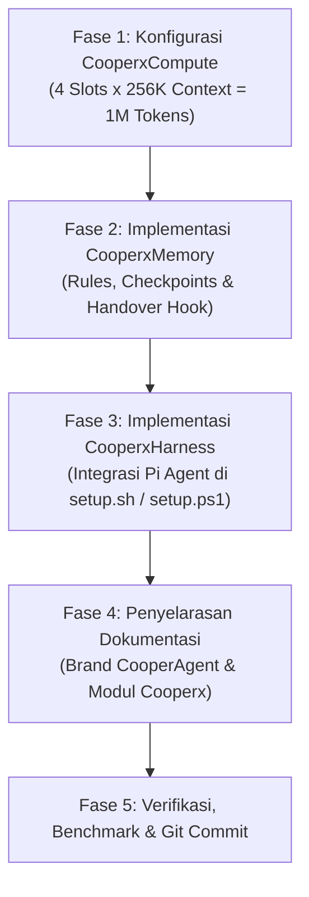

# 🚀 Master Technical Plan: CooperAgent & Cooperx Module Architecture

> **Project Product Name:** **`CooperAgent`**  
> **Module Naming Standard:** **`Cooperx{Feature_Name}`**  
> **Status:** APPROVED & READY TO EXECUTE  
> **Date:** 20 Agustus 2026  
> **Hardware Target:** 3x NVIDIA GeForce RTX 3090 (72 GB VRAM) + Intel Core Ultra 7 265 (20 Cores)  

---

## 1. Executive Summary & Brand Alignment

**CooperAgent** adalah platform *Enterprise Autonomous Coding Agent* generasi masa depan yang mengintegrasikan ekosistem multi-agent harness (**Grok Build TUI & Pi Agent CLI**) dengan infrastruktur komputasi lokal berkapasitas tinggi (**Qwen 27B Q8_0 pada 3x RTX 3090**) dan sistem persistensi memori mandiri (**`CooperxMemory`**).

Setiap subsistem dan inovasi arsitektur dalam platform CooperAgent distandarisasi menggunakan kode seri **`Cooperx{Feature}`**:
* **`CooperxCompute`:** Alokasi komputasi 4 Slots x 256K Dedicated Context (Total 1.048.576 Tokens) dengan Speculative Acceleration.
* **`CooperxMemory`:** Continuous State Checkpointing & 90% Context Handover Harness (terinspirasi dari Claude Code & Hermes Agent).
* **`CooperxHarness`:** Ekosistem multi-agent fleksibel yang mendukung **Grok Build (Rust TUI)** dan **Pi Agent (Inline CLI)** secara native.
* **`CooperxTelemetry`:** Real-time Dashboard & Next.js 14 API Gateway (Port `8987`) dengan Developer Identity Tracking.
* **`CooperxStandard`:** Adaptive Project Standardization Wizard (`/standardization`).

---

## 2. Rincian Arsitektur Modul Baru

```
┌─────────────────────────────────────────────────────────────────────────────┐
│                           CooperAgent ARCHITECTURE                          │
├─────────────────────────────────────────────────────────────────────────────┤
│                                                                             │
│  1. CooperxHarness (Multi-Agent Client)    2. CooperxMemory (State Harness) │
│  ┌────────────────────────────────────┐   ┌───────────────────────────────┐ │
│  │ ⚡ Grok Build (Fullscreen Rust TUI)│   │ 📝 Continuous Checkpoint      │ │
│  │ 🤖 Pi Agent (Lightweight CLI)      │ + │ ⚠️ 90% Context Warning & Card │ │
│  │ Terintegrasi di setup.sh/ps1       │   │ 🔄 Instant 0-Token Rehydration│ │
│  └────────────────────────────────────┘   └───────────────────────────────┘ │
│                               ▲                                             │
│                               │ HTTP / SSE Stream (Bearer dev-<name>)       │
│                               ▼                                             │
│  3. CooperxTelemetry (API Gateway :8987 & SQLite Leaderboard)               │
│  ┌────────────────────────────────────────────────────────────────────────┐ │
│  │ - Non-blocking Stream Splitter (ReadableStream.tee())                  │ │
│  │ - Developer Identity & Token Tracker (usage.db)                        │ │
│  └────────────────────────────────────────────────────────────────────────┘ │
│                               ▲                                             │
│                               │ Forward Clean Stream                        │
│                               ▼                                             │
│  4. CooperxCompute (High-Capacity 1M Context on 3x RTX 3090 :8001)          │
│  ┌────────────────────────────────────────────────────────────────────────┐ │
│  │ - 4 Concurrent Slots x 256.000 Tokens (Total 1.048.576 Tokens)          │ │
│  │ - Primary: Qwen 27B Q8_0 | Draft: Qwen 0.5B Speculative Accelerator     │ │
│  │ - Flash Attention & KV-Cache q4_0 (~22.26 GB per GPU, 2.3 GB Buffer)   │ │
│  └────────────────────────────────────────────────────────────────────────┘ │
└─────────────────────────────────────────────────────────────────────────────┘
```

---

## 3. Rincian Teknis per Modul

### ⚡ A. `CooperxCompute`: 4 Slots x 256K Context (Total 1M Tokens)
* **Konfigurasi Server (`server-optimize.sh` & `run-qwen.sh`):**
  - `--ctx-size 1048576`: Total 1.048.576 tokens context window.
  - `--parallel 4`: 4 developer slots independen (**262.144 tokens dedicated per slot**).
  - `--cache-type-k q4_0 --cache-type-v q4_0`: Kuantisasi KV-Cache hemat 50% memori.
  - `--spec-type draft-simple --model-draft Qwen2.5-Coder-0.5B-Q8_0.gguf --spec-draft-device CUDA0 --spec-draft-ngl 999 --spec-draft-n-max 8`: Speculative Decoding kilat.
  - `--threads 16 --threads-batch 20 --poll 100`: Pemanfaatan 20 Core CPU Intel Ultra 7.
* **VRAM Safety:** Total beban per RTX 3090 adalah **22.26 GB / 24.57 GB** (Sisa buffer bebas **~2.31 GB per GPU**).

---

### 🧠 B. `CooperxMemory`: Continuous State Handover Harness
Terinspirasi dari arsitektur memori **Claude Code** (`CLAUDE.md` memory ledger) dan **Hermes Agent** (Dual-tier episodic/semantic eviction):

1. **Continuous Checkpoint (`.agents/memory/session_state.md`):**
   Agent secara otomatis mencatat state kerja setelah setiap operasi file/test selesai:
   - *Goal Utama Proyek & Arsitektur Terpilih*
   - *Daftar File yang Telah Dibuat / Diuji*
   - *Active Sub-task & Checklist `plan.md` yang Tersisa*
2. **Context Warning Hook pada 90% (~230K Tokens):**
   Agent menampilkan Handover Card yang memandu developer melakukan reset instan:
   ```text
   ┌─────────────────────────────────────────────────────────────┐
   │ ⚠️ CooperxMemory NOTICE: Context 90% reached                │
   │ State kerja tersimpan aman di .agents/memory/session_state.md│
   │                                                             │
   │ 💡 CARA MELANJUTKAN DENGAN CONTEXT BERSIH (0 TOKEN):        │
   │ 1. Ketik `/new` di terminal agent                         │
   │ 2. Ketik: `Lanjutkan session_state.md`                      │
   └─────────────────────────────────────────────────────────────┘
   ```
3. **Instant Rehydration (<1 Detik):**
   Pada sesi baru yang bersih (**0 token**), agent hanya membaca `session_state.md` (**~1.500 token**) dan langsung melanjutkan coding tanpa membawa 200K token sampah log terminal lama!

---

### 🤖 C. `CooperxHarness`: Integrasi Pi Agent & Grok Build
Penyempurnaan skrip onboarding multi-OS ([`setup.sh`](setup.sh) & [`setup.ps1`](setup.ps1)):

1. **Menu Pilihan Agent Interaktif:**
   ```text
   Pilih Coding Agent yang ingin dipasang di komputer Anda:
     1) Grok Build (Fullscreen Rust TUI & Visual Diff) [Rekomendasi Utama]
     2) Pi Agent (Lightweight Inline CLI) [Alternatif Cepat]
     3) Keduanya (Grok + Pi)
   ```
2. **Otomasi Konfigurasi Pi Agent:**
   Membuat file konfigurasi Pi Agent (`~/.pi/config.json` atau environment variables) yang otomatis mengarah ke `http://192.168.2.143:8987/v1` dengan `api_key = "dev-$DEV_NAME"`.

---

## 4. Penyelarasan Dokumentasi Resmi Brand `CooperAgent`

File-file berikut akan diperbarui dengan identitas merek resmi **CooperAgent** dan modul **`Cooperx`**:
1. [`AGENTS.md`](AGENTS.md) — Single Source of Truth CooperAgent.
2. [`ARCHITECTURE.md`](ARCHITECTURE.md) — Cetak biru arsitektur lengkap CooperAgent.
3. [`README.md`](README.md) — Panduan onboarding developer CooperAgent.
4. [`docs/PRD.md`](docs/PRD.md) & [`docs/CONTEXT.md`](docs/CONTEXT.md) — Dokumen spesifikasi produk resmi.
5. [`CHANGELOG.md`](CHANGELOG.md) — Catatan rilis checkpoint resmi CooperAgent.

---

## 5. Rencana Eksekusi Bertahap



---

## 6. Keputusan Pengguna (User Review)

> [!IMPORTANT]
> Mohon tinjau master plan CooperAgent di atas. Jika Anda menyetujui seluruh arsitektur modul **`CooperxCompute`**, **`CooperxMemory`**, **`CooperxHarness`**, dan standarisasi merek **`CooperAgent`**, silakan beri persetujuan untuk kita mulai eksekusi!
