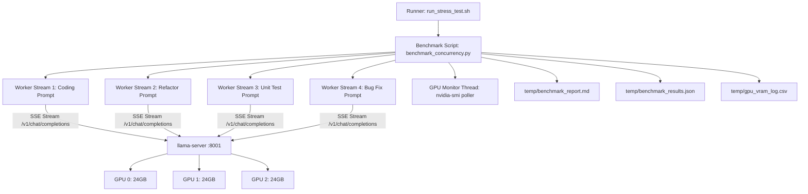

# Rencana Implementasi: Fase 3 — Multi-User Concurrency & Stress Testing Suite

## Goal Description
Menguji dan memvalidasi keandalan, performa throughput (tokens/sec), latensi *Time-to-First-Token* (TTFT), serta stabilitas VRAM KV-Cache dari backend inferensi **`llama-server` (Qwen 3.8 / 2.5 27B Q8_0)** pada konfigurasi multi-GPU (3x RTX 3090 - total 72 GB VRAM). Pengujian ini memastikan server mampu melayani 2 hingga 4+ developer internal secara simultan saat coding tanpa terjadi Out-of-Memory (OOM) atau degradasi performa drastis.

Semua hasil pengujian, log VRAM, dan laporan markdown akan disimpan secara terpusat di folder **`temp/`** di dalam repositori proyek agar dapat dibuka langsung melalui editor/browser lokal.

---

## User Review Required
> [!NOTE]
> Server inferensi saat ini berjalan dengan opsi `--parallel 4`, `--flash-attn`, dan alokasi context 131K tokens. Pengujian akan dilakukan secara non-destruktif terhadap endpoint lokal `http://127.0.0.1:8001/v1`.

> [!IMPORTANT]
> Seluruh artefak pengujian (skrip runner, log VRAM, raw data JSON, dan laporan akhir `benchmark_report.md`) akan disimpan di direktori `temp/` di root repositori.

---

## Proposed Changes & Test Architecture



---

## Proposed Files & Scripts

### Component 1: Concurrency Testing Engine & Reporting

#### [NEW] [benchmark_concurrency.py](file:///home/gspe-ai1/project/gspexgrok-agent/benchmark_concurrency.py)
Skrip Python async menggunakan `httpx.AsyncClient` dengan fitur:
1. **Realistic Coding Workload Prompts:** Dataset simulasi prompt developer yang realistis (analisis bug, implementasi algoritma Rust/Python, refactoring kode, dan pembuatan unit test).
2. **Streaming Metrics Aggregator:**
   - **TTFT (Time to First Token):** Waktu dari request dikirim hingga chunk teks/CoT pertama diterima.
   - **Generation Time:** Total durasi generasi token output.
   - **Tokens Per Second (TPS):** Dihitung per worker stream dan total aggregate server throughput.
   - **CoT Reasoning Verification:** Memastikan output reasoning (`reasoning_content`) tetap terproses dengan benar pada multi-stream.
3. **GPU VRAM Tracker:** Thread latar belakang yang mencatat alokasi memori tiap GPU (`nvidia-smi`) sebelum, saat puncak inferensi (peak load), dan setelah inferensi selesai.
4. **Export Output ke `temp/`:**
   - `temp/benchmark_report.md`: Laporan tabel performa dalam format Markdown.
   - `temp/benchmark_results.json`: Raw metrics terstruktur.
   - `temp/gpu_vram_log.csv`: Log snapshot VRAM per detik per GPU.

#### [NEW] [run_stress_test.sh](file:///home/gspe-ai1/project/gspexgrok-agent/run_stress_test.sh)
Skrip bash pembungkus (*orchestrator*) yang menjalankan matrix pengujian berurutan:
- **Test 1: Single Stream Baseline** (1 Developer — baseline speed & TTFT target ~27 tps / ~550 ms).
- **Test 2: Dual Stream Concurrency** (2 Developer paralel).
- **Test 3: Quad Stream Capacity** (4 Developer paralel — kapasitas nominal penuh `--parallel 4`).
- **Test 4: Over-Subscription / Queue Behavior** (6 Developer paralel — menguji mekanisme continuous batching & queueing tanpa crash).

---

## Verification Plan

### Automated Execution
1. Pastikan folder `temp/` sudah dibuat di root repository:
   ```bash
   mkdir -p temp
   ```
2. Jalankan rangkaian stress test secara otomatis:
   ```bash
   chmod +x run_stress_test.sh
   ./run_stress_test.sh
   ```
3. Verifikasi file laporan berhasil ter-generate:
   - [temp/benchmark_report.md](file:///home/gspe-ai1/project/gspexgrok-agent/temp/benchmark_report.md)
   - [temp/benchmark_results.json](file:///home/gspe-ai1/project/gspexgrok-agent/temp/benchmark_results.json)
   - [temp/gpu_vram_log.csv](file:///home/gspe-ai1/project/gspexgrok-agent/temp/gpu_vram_log.csv)

### Manual Verification
1. Periksa alokasi VRAM ketiga GPU RTX 3090 tidak mengalami memory leak atau OOM saat 4-6 request berjalan simultan.
2. Tinjau nilai TTFT dan aggregate throughput per detik di [temp/benchmark_report.md](file:///home/gspe-ai1/project/gspexgrok-agent/temp/benchmark_report.md).
