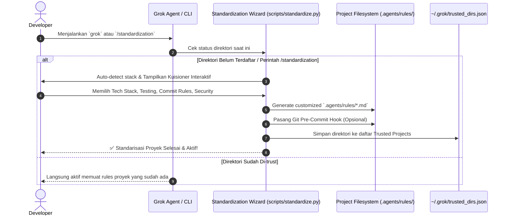

# Rencana Implementasi: Fase 4 — Adaptive Project Standardization Wizard & `/standardization` Command

## Goal Description
Mengganti pendekatan template statis dengan **Sistem Standarisasi Adaptif berbasis Kuisioner Interaktif (Wizard)**. Ketika developer membuka direktori proyek baru atau menjalankan perintah **`/standardization`**, sistem akan:
1. Melakukan deteksi otomatis (*auto-detection*) terhadap tech stack proyek (`Cargo.toml`, `pyproject.toml`, `package.json`, `go.mod`, dll).
2. Mengajukan kuisioner interaktif singkat (5 pertanyaan adaptif) mengenai arsitektur, testing, konvensi commit, dan keamanan.
3. Secara dinamis men-generate ruleset khusus untuk proyek tersebut di `.agents/rules/` serta mengaktifkan proteksi commit.
4. Mencatat direktori tersebut sebagai *trusted & initialized workspace*.

Semua dokumen rencana dan laporan disimpan di folder **`temp/`** repositori.

---

## User Review Required
> [!NOTE]
> Pendekatan ini sangat adaptif: Proyek backend Rust, microservice Python, frontend TypeScript, maupun data pipeline akan memiliki aturan yang spesifik dan relevan tanpa membebani developer.

> [!IMPORTANT]
> Wizard dapat dipanggil dengan 2 cara:
> 1. Otomatis saat pertama kali agent mendeteksi direktori belum pernah di-trust.
> 2. Kapan saja secara manual melalui perintah terminal `grok-standardize` atau slash command `/standardization`.

---

## Architecture & Interaction Flow



---

## Proposed Changes & Files

### Component 1: Interactive Standardization Wizard Engine

#### [NEW] [scripts/standardize.py](file:///home/gspe-ai1/project/gspexgrok-agent/scripts/standardize.py)
Script Python interaktif (CLI Wizard) mandiri:
1. **Auto-Detection Engine:**
   - Deteksi otomatis: Rust (`Cargo.toml`), Python (`pyproject.toml`, `requirements.txt`), Node/TypeScript (`package.json`), Go (`go.mod`), Docker/Infra.
2. **Interactive Questionnaire (5 Pertanyaan Cepat):**
   - **Q1: Primary Language & Framework** (Pilihan auto-selected berdasarkan deteksi).
   - **Q2: Testing Strategy** (TDD Strict, Pytest/Cargo-test/Vitest, Mocking policy).
   - **Q3: Git Commit & Branching Style** (Conventional Commits `feat/fix`, Ticket Prefix `PROJ-123`, dll).
   - **Q4: Code Quality & Linters** (Ruff, Black, Clippy, ESLint, Prettier).
   - **Q5: Security & Data Privacy Level** (Strict Zero-Leakage, Private API Only, Internal Server).
3. **Dynamic Rule Generator:**
   - Menghasilkan file markdown yang rapi di `.agents/rules/`:
     * `.agents/rules/00-project-context.md` (Arsitektur & stack yang dipilih)
     * `.agents/rules/01-coding-standards.md` (Linter & style yang disepakati)
     * `.agents/rules/02-git-workflow.md` (Standar commit & branching)
     * `.agents/rules/03-testing-guidelines.md` (Aturan test & TDD)
     * `.agents/rules/04-security-privacy.md` (Guardrail keamanan & anti-leak)
4. **Git Hook & Trust Registry:**
   - Mengaktifkan `git config core.hooksPath scripts/hooks`.
   - Menambahkan hash/path direktori ke `~/.grok/trusted_dirs.json`.

#### [NEW] [bin/grok-standardize](file:///home/gspe-ai1/project/gspexgrok-agent/bin/grok-standardize)
Executable symlink / wrapper shell agar developer dapat memanggil `grok-standardize` dari terminal mana saja.

---

### Component 2: Slash Command & Agent Integration

#### [NEW] [.agents/skills/standardization/SKILL.md](file:///home/gspe-ai1/project/gspexgrok-agent/.agents/skills/standardization/SKILL.md)
Definisi slash command `/standardization`:
- Memungkinkan agent mengeksekusi wizard penyesuaian aturan langsung dari dalam sesi percakapan chat.

#### [MODIFY] [setup.sh](file:///home/gspe-ai1/project/gspexgrok-agent/setup.sh)
- Menambahkan symlink/path `grok-standardize` ke `~/.local/bin/` saat onboarding pertama kali.

---

## Verification Plan

### Automated & Interactive Tests
1. Jalankan wizard secara interaktif di direktori test / proyek saat ini:
   ```bash
   python3 scripts/standardize.py
   ```
2. Verifikasi folder `.agents/rules/` berhasil ter-generate dengan konten yang sesuai dengan jawaban kuisioner.
3. Verifikasi file `~/.grok/trusted_dirs.json` berhasil mencatat path direktori.
4. Jalankan ulang script untuk memastikan direktori langsung dikenali sebagai trusted (dengan opsi re-run jika diinginkan).

### Manual Verification
1. Tinjau kemudahan dan kejelasan navigasi kuisioner di terminal.
2. Pastikan file aturan yang dihasilkan ringkas, padat, dan langsung dipahami oleh coding agent.
