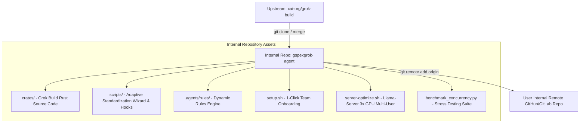

# Rencana Implementasi: Forking & Customization Grok Build ke Repository Internal

## Goal Description
Meng-clone dan mem-fork source code resmi **`xai-org/grok-build` (Rust)** ke dalam repository internal tim (`gspexgrok-agent`). Langkah ini memberikan tim kendali penuh 100% atas:
1. Kustomisasi internal binary (branding internal, default routing ke local llama-server, penghapusan ketergantungan cloud login).
2. Integrasi custom coding tools & slash command `/standardization`.
3. Kemampuan merilis binary pre-compiled internal yang siap pakai untuk laptop seluruh tim engineer tanpa tergantung pada server xAI luar.
4. Menghubungkan workspace ini ke remote repository GitHub/GitLab internal yang dibuat oleh user.

Semua file rencana dan panduan disimpan di folder **`temp/`** di repositori.

---

## User Review Required
> [!NOTE]
> Toolchain Rust (`cargo 1.97.1` & `rustc 1.97.1`) sudah terpasang dan siap digunakan untuk kompilasi lokal.

> [!IMPORTANT]
> Silakan buat repository kosong di GitHub/GitLab internal tim Anda, lalu berikan URL remote repo tersebut (contoh: `git@github.com:your-org/gspexgrok-agent.git` atau HTTPS URL).

---

## Architecture & Integration Strategy



---

## Proposed Steps

### Step 1: Clone Source Code Upstream Grok Build
Meng-clone repo upstream `https://github.com/xai-org/grok-build` ke folder kerja internal tanpa menimpa deliverable konfigurasi & benchmark yang telah kita buat.

### Step 2: Kustomisasi Source Code Rust
1. **Default Server Routing:** Mengubah konfigurasi default client agar langsung mengarah ke `http://192.168.2.143:8001/v1` (atau `127.0.0.1:8001/v1`).
2. **Branding & Telemetry Off:** Mematikan default cloud telemetry dan menyesuaikan welcome header TUI menjadi *GSPExGrok Internal Agent*.
3. **Slash Command Integration:** Mendaftarkan command `/standardization` langsung ke router command bawaan.

### Step 3: Integrasi Adaptive Standardization Wizard
Menerapkan script `scripts/standardize.py` yang mengajukan 5 pertanyaan adaptif sebelum sesi coding pertama kali dimulai pada proyek baru.

### Step 4: Menghubungkan Git Remote & Initial Push
1. Inisialisasi git repository lokal: `git init`.
2. Menambahkan file `.gitignore` yang bersih (mengecualikan `temp/*.csv`, build binary `target/`, model weights).
3. Commit seluruh aset internal dan push ke remote repository tim yang dibuat oleh user.

---

## Verification Plan

### Automated Tests
1. Verifikasi kompilasi Rust source:
   ```bash
   cargo check --workspace
   ```
2. Build binary internal:
   ```bash
   cargo build --release
   ```
3. Uji coba wizard standarisasi:
   ```bash
   python3 scripts/standardize.py
   ```

### Manual Verification
1. Menjalankan binary hasil build kustom dan memastikan TUI langsung mengenali backend inference server Qwen 27B internal.
2. Memastikan repository tim di GitHub/GitLab sudah tersinkronisasi dengan baik.
